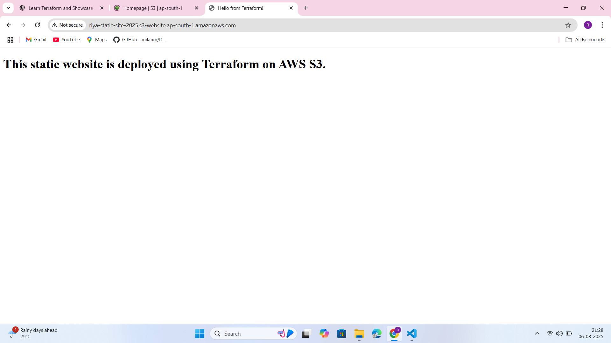
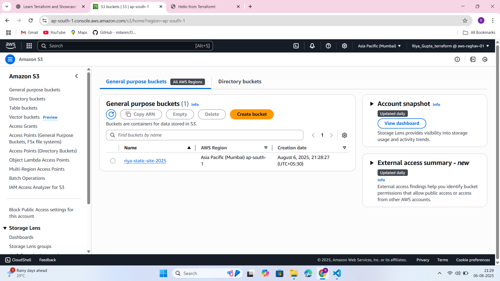

# 🌐 Terraform Project 2: Static Website Hosting on AWS S3

This project demonstrates how to host a static website using **Amazon S3** and **Terraform**, following AWS's 2023+ best practices (ACLs disabled, ownership controls enforced, website endpoint enabled).

---

## 🚀 What It Does

- Creates an S3 bucket for static website hosting
- Sets **ownership controls** and **public access policy**
- Uploads an `index.html` file
- Outputs the **public website URL**
- Fully automates infrastructure-as-code using Terraform

---

## 📁 Files Included
```
terraform-s3-static-site/
│
├── main.tf # Main infrastructure
├── variables.tf # Input variables
├── outputs.tf # Outputs (URL)
├── terraform.tfvars # Custom variable values
├── index.html # HTML page hosted on S3
├── README.md # Project documentation
---
```

## 🔧 Setup Instructions

### 1. Prerequisites

- AWS CLI configured (`aws configure`)
- Terraform installed (`>= 1.3`)
- IAM user with S3 and policy permissions

### 2. Configure Your Variables

Edit `terraform.tfvars` and set a **globally unique** bucket name:

```hcl
bucket_name = "riya-static-site-2025"
S3 bucket names must be globally unique, lowercase, and DNS-compliant.
```

### 3. Initialize Terraform
terraform init

### 4. Deploy Infrastructure

terraform apply

### 5. View Your Site
Terraform will output the website URL:

Outputs:

website_url = "http://riya-static-site-2025.s3-website-us-east-1.amazonaws.com"
Open it in your browser 🎉

## 🧹 Cleanup
To destroy all resources and avoid charges:

terraform destroy

### Screenshot


